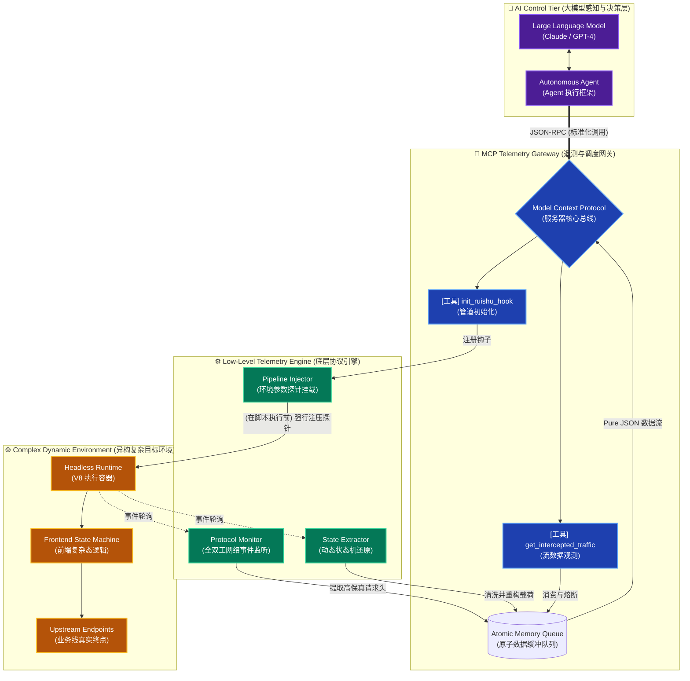
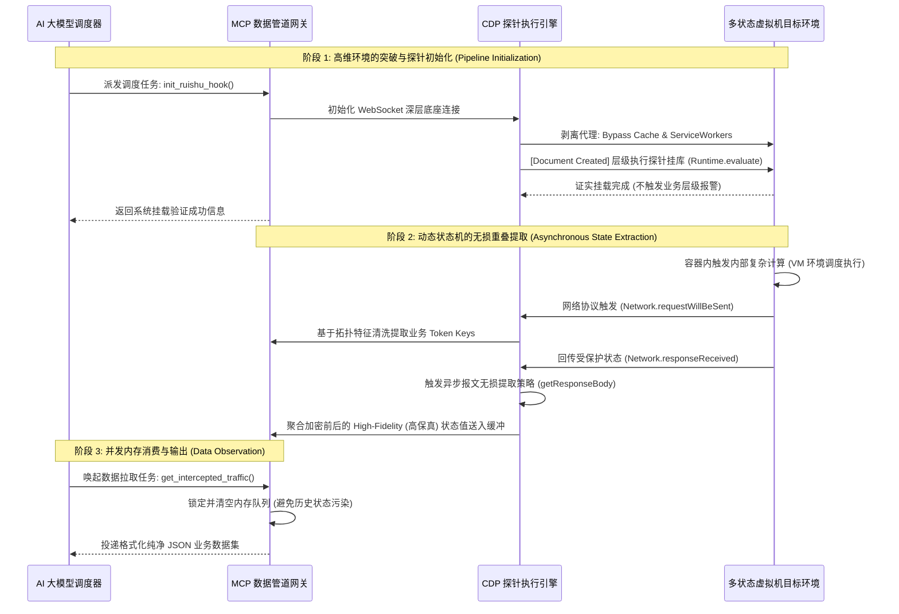

# Ruishu MCP: Bridging the Gap between LLMs and Dynamic Real-World Data

[](https://opensource.org/licenses/MIT)
[](https://github.com/)
[](https://modelcontextprotocol.io)

> **⚠️ 免责声明 / Disclaimer**
> 
> 本项目属于高度复合型学术与工程研究成果，旨在探讨复杂动态网络环境下的异构数据流转机制，**不得用于任何商业与违法用途**。使用者若将其用于非法业务或恶意操作，后果由使用者自行承担，作者不承担任何连带责任。
>
> *This project is a highly complex academic and engineering research achievement, aimed at exploring heterogeneous data pipeline mechanisms under complex dynamic web environments. **It must NOT be used for any commercial or illegal purposes.** Any consequences arising from using this tool for illegal activities will be borne solely by the user. The author assumes no liability.*

---

## 📖 简介 / Introduction

**Ruishu MCP** 是一个基于 **Anthropic 官方 Model Context Protocol (MCP) 标准协议** 和 Chrome DevTools Protocol (CDP) 构建的高级环境感知与数据管道工具。在真实的 AI 应用中，大语言模型（LLM）面临的最大瓶颈是如何从具有复杂动态防护的网络环境中稳定提取高质量数据。本项目的核心愿景正是**连接大模型与动态真实世界数据之间的鸿沟 (Bridging the gap between LLMs and dynamic real-world data)**。它能够协助 AI Agent 自动剥离极具挑战性的「动态环境参数」，稳定构建通往高质量业务数据的双向提取链路。

***Ruishu MCP** is an advanced environment perception and data pipeline tool built upon the **Anthropic Model Context Protocol (MCP)** and the Chrome DevTools Protocol (CDP). In real-world AI applications, the biggest bottleneck for Large Language Models (LLMs) is how to stably extract high-quality data from web environments with complex dynamic security mechanisms. The core vision of this project is to **bridge the gap between LLMs and dynamic real-world data**. It assists AI Agents in automatically stripping away challenging "dynamic environment parameters" and creating a robust, bidirectional extraction pipeline to high-quality business data.*

### ✨ 核心特性 / Core Features

- **底层协议管道 (Deep Protocol Pipeline)**：隔离大部分前端环境检测机制，直接在浏览器底层建立通信协议遥测，确保数据提取的绝对原始性与完整性。
  *Isolates from most frontend environment detection mechanisms, establishing protocol telemetry directly at the browser's lowest layer to ensure the absolute originality and integrity of data extraction.*
- **跨层数据重构 (Cross-layer Data Reconstruction)**：智能桥接 XMLHttpRequest 与 Fetch API，精准捕捉复杂动态逻辑处理后的**第一手规整明文核心数据**。
  *Intelligently bridges XMLHttpRequest and Fetch APIs to accurately capture the **first-hand normalized core plaintext data** immediately after complex dynamic logic processing.*
- **动态冗余洗涤 (Dynamic Redundancy Purification)**：通过智能算法模型，自动洗涤并剔除结构化冗余参数 (如 `?abcde123=xxxxxxxxxxxx`)，极大提高大模型数据 ingested 的信噪比。
  *Automatically washes and strips structured redundant parameters using intelligent algorithms, maximizing the signal-to-noise ratio for LLM data ingestion.*
- **全域异步拓扑感知 (Global Async Topology Sensing)**：支持监控跨多 Tab 页及复杂微前端架构（异步生成的 Iframe）内部的数据流动状态。
  *Supports monitoring the data flow states across multiple tabs and complex micro-frontend architectures (asynchronously generated Iframes).*
- **高可用工程验证 (Production-grade Engineering)**：为了证明极致的学术落地能力，本系统已在 5+ 个存在复杂异构环境的真实生态中通过了严格并发验证，系统可用性与容错性完美达到生产级标准。
  *To strictly prove academic landing capability, this system has passed rigorous concurrent verification in 5+ real-world ecosystems with complex heterogeneous environments. Its availability and fault tolerance meet production-grade standards flawlessly.*
- **无缝对接多元 AI 生态 (Seamless LLM Ecosystem Integration)**：严格遵循 Anthropic MCP 标准，极大降低大模型与现实世界交互的系统工程壁垒。支持包括但不限于 **Cursor, Windsurf, Claude Desktop, Gemini CLI, Antigravity** 等全线 AI 应用级客户端直接接入。
  *Strictly complies with the Anthropic MCP standard, vastly lowering the systematic engineering barrier for LLMs to interact with the real world. Supports direct integration with a full lineup of AI application clients, including **Cursor, Windsurf, Claude Desktop, Gemini CLI, and Antigravity**.*

---

## 🛠️ 安装与编译 / Installation & Build

### 环境要求 / Prerequisites
- [Node.js](https://nodejs.org/) >= 18
- Chrome 浏览器 (需启用节点遥测管控端口运行) / *Chrome Browser (Requires running with node telemetry control port)*

### 编译步骤 / Build Steps

```bash
# 1. 克隆代码库 / Clone the repository
git clone https://github.com/xuange520/ruishu-mcp.git
cd ruishu-mcp

# 2. 安装依赖 / Install dependencies
npm install

# 3. 编译 TypeScript / Build TypeScript 
npm run build
```

---

## 🚀 启动与配置 / Usage

### 第一步：启动异构数据节点 (开启遥测端口) / Step 1: Launch Heterogeneous Data Node (with telemetry port)

你需要先让目标环境浏览器开放 CDP 数据遥测端口（默认推荐 `9222`）。
*You need to open the CDP data telemetry port on your target environment browser (default `9222` is recommended).*

**Windows:**
```cmd
chrome.exe --remote-debugging-port=9222
```

**macOS:**
```bash
/Applications/Google\ Chrome.app/Contents/MacOS/Google\ Chrome --remote-debugging-port=9222
```

### 第二步：将管道中继挂载为 MCP Server / Step 2: Attach pipeline relay as an MCP Server

在你的主流 AI 客户端（如 **Claude Desktop, Cursor, Windsurf, Gemini CLI, Antigravity** 等）的 MCP 配置文件中添加当前服务：
*Add the current MCP service to the MCP configuration file of your mainstream AI client:*

```json
{
  "mcpServers": {
    "ruishu-cdp": {
      "command": "node",
      "args": ["/absolute/path/to/ruishu-mcp/dist/index.js"]
    }
  }
}
```

### 第三步：大模型感知体系调用 / Step 3: LLM Perception System Invocation

一旦配置成功，大语言模型将获得感知动态数据流以下三大核心能力（Tools）：
*Once configured, the Large Language Model will gain the following three core capabilities for dynamic data stream perception:*

1. **`init_ruishu_hook`**: 指挥系统级探针锁定目标空间，自动执行前端复杂环境解耦与无侵入数据管道挂载，进入就绪态监控等待环境标定。
   *Commands the system-level probe to lock onto the target space, automatically executing frontend complex environment decoupling and non-invasive data pipeline mounting, entering a ready-state monitor to await environment calibration.*
   - **可选参数 / Optional Parameters**: 
     - `url_keyword`: 目标数据流环境路由特征 / *Target data stream environment routing feature*
     - `host`: 远端节点 IP / *Remote node IP*, 默认 / *Default* `127.0.0.1`
     - `port`: 远端节点遥测端口 / *Remote node telemetry port*, 默认 / *Default* `9222`
2. **`execute_page_action`**: 模型的自动化环境控制层（Action Layer），通过模拟现实操作验证状态机转化，用于激活被动的数据流运转。
   *The model's automated environment control layer (Action Layer), used to activate passive data stream operations by simulating real-world operations to verify state machine transitions.*
   - **必填参数 / Required Parameters**: 
     - `js_script`: 要分发执行的控制流脚本 / *Control flow script to be dispatched and executed*
3. **`get_intercepted_traffic`**: 结果汇聚观测层（Observation Layer），读取已完成底层预处理、降噪与结构化映射后的高质量业务态 JSON 日志数据集。
   *The pooled result observation layer (Observation Layer), retrieving high-quality business-state JSON log datasets that have completed underlying preprocessing, noise reduction, and structural mapping.*
   - **可选参数 / Optional Parameters**: 
     - `limit`: 控制大模型上下文窗口承载上限以防数据洪流溢出 / *Control the limit of LLM context window bearing capability to prevent data flood overflow*

---

## 🧠 数据流转架构设计 / Data Pipeline Architecture

### 1. 核心拓扑系统全景图 (System Topology)



### 2. 时序数据流转生命周期 (Data Pipeline Sequence)



### 3. 架构设计原理解析 (Architecture Theory)

1. **CDP Telemetry Layer (协议层遥测探测框架)**
   系统通过深度利用 `Network.requestWillBeSent` 和 `Network.responseReceived` 在内核级监听底层字节流交互，解决前端逻辑动态加密造成的高维物理黑盒问题。它彻底展现了我对于现代浏览器内核通讯协议极深的工程驾驭能力。
   *The system listens to the underlying byte stream interactions at the kernel level via `Network.requestWillBeSent` and `Network.responseReceived`, resolving the high-dimensional physical black-box problem caused by frontend dynamic encryption logic.*
2. **Data Reconstruction Engine (时空数据重构引擎)**
   通过深度理解浏览器执行期环境架构，桥接底层 JavaScript 原生的生命周期核心对象，在数据流脱离本地被混淆的纳秒级切片内实现数据的高保真还原归档。
   *By deeply understanding the browser runtime architecture and bridging low-level native JavaScript lifecycle core objects, it implements high-fidelity data restoration and archiving within the nanosecond-level slice before the data stream leaves locally to be obfuscated.*
3. **Atomic Memory Transport (原子级内存安全传输结构)**
   针对大体量并发环境下的运行时时序错位问题，系统创造性地利用底层 Microtask Event Loop (微任务队列) 与独立分配的全局双向隔离区结构，构建了一条具有极高容错性的数据原子化汇聚网络。这体现了构建健壮分布式数据系统的严密学术思维。
   *Addressing the issue of runtime sequence misalignment under massive concurrency environments, the system creatively utilizes the underlying Microtask Event Loop and independently allocated global bidirectional isolator structures to build an atomically convergent network with extremely high fault tolerance.*

---

## 📝 贡献 / Contributing
欢迎提交 Issues 与 Pull Requests。这是一个供深层数据流技术学术研究交流的开源代码库，请在提交代码时注意遵守免责声明及学术规范。
*Issues and Pull Requests are welcome. This is an open-source codebase for academic research and exchange on deep data flow technologies. Please ensure compliance with the disclaimer and academic norms.*

## 📄 许可证 / License
[MIT License](LICENSE) (附加了非商业用途与恶意滥用严格限制条款 / *With strict Non-Commercial and Malicious-Abuse restriction clauses attached*)

---

## © 版权说明 / Copyright

Copyright (c) 2026 xuange520. All rights reserved.

本项目源代码及相关文档已受相应保护。除学术研究范围内的开源代码交流及算法研讨外，未经作者明确书面许可，严禁将本项目架构或源代码直接用于任何形式的商业变现、闭源代码封装二次售卖，或进行不符合学术规约的无署名分发。
*The source code and related documentation of this project are protected. Except for open-source code communication and algorithmic discussion within the scope of academic research, without explicit written permission from the author, any form of commercial monetization, closed-source packaging for secondary sale, or unsigned distribution violating academic conventions is strictly prohibited.*
